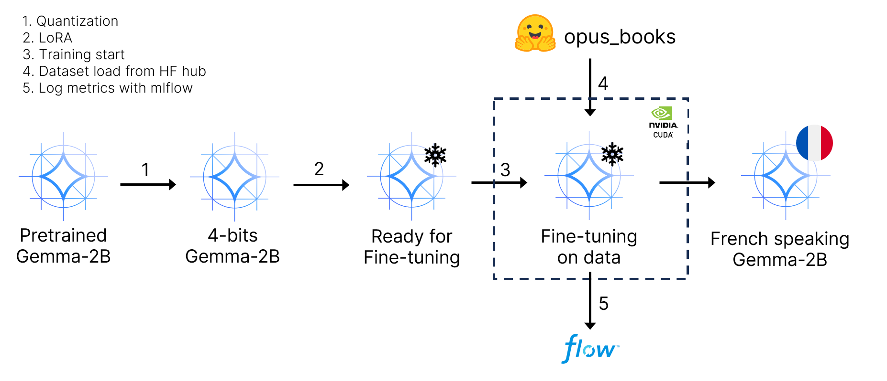
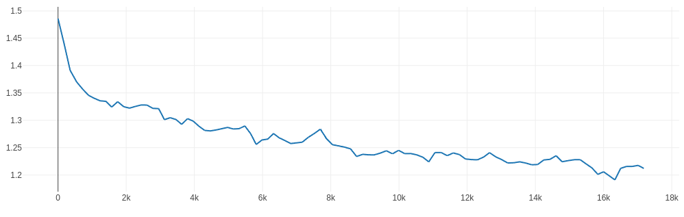

# gemma-2b-translation-finetuning

This repository aims at giving minimal resources to finetune a quantized (+LoRA) version of Gemma 2B.

##  &#x2705; Prerequisites

- **Gemma access** : One needs a granted access to Gemma models. This can be done [accepting Google terms of use](https://huggingface.co/google/gemma-2b).
- **Gemma-2B-pretrained model** : Get a local [copy of the model](https://huggingface.co/google/gemma-2b) or import it with HuggingFace library.
- **Data** : The [opus-books (en-fr) dataset](https://huggingface.co/datasets/opus_books/tree/main/en-fr) can be found in the HuggingFace hub.
- **GPU** : I made the model fit (during training - see batch_size below) in a RTX3080 (10GB VRAM)
- **Required packages** : Required packages can be installed with the given `requirements.txt`

## &#127899; Fine-tuning process

## &#128201; Some results

After a training of roughly 5 hours I have already been able to notice interesting results.

- **Here is the loss curve I have got**

- &#127881; **Despite "too-long" outputs, let's have a look on several translations :**

|                                             | **pretrained**       | **finetuned**                            |
|---------------------------------------------|---------------------|------------------------------------------------|
| **Thank you.**                                  | *repeated question* | Merci.                                         |
| **Training it was very interesting !**         | *repeated question* | L'entraînement était très intéressant !        |
|**I am not that good at translating to French** | *repeated question* | Je ne suis pas très bon à traduire en français |

